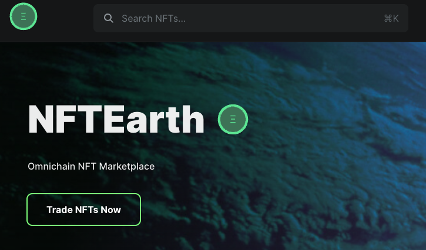

<h1 align="center">NFTEarth</h1>
  

# App Screencap: 

Omnichain NFT protocol.

NFT Exchange, NFTFi, SocialFi, GameFi, NFT Launchpad, and AI-infused NFTs - all part of the NFTEarth protocol vision.

NFTEarth is bringing the first Omnichain inscription tooling/markets to NFT enthusiasts - creating the potential for anyone to easily inscribe whatever they would like onchain!

# Built With

- [ReservoirKit](https://docs.reservoir.tools/docs/reservoir-kit)
- [Reservoir Protocol and API](https://reservoirprotocol.github.io/)
- [Next.js](https://nextjs.org/)
- [React.js](https://reactjs.org/)
- [Ethers.io](https://ethers.io/)
- [WAGMI](https://wagmi.sh/)
- [Stitches](https://stitches.dev/docs/variants)

---

# Community

- [X](https://twitter.com/NFTEarth_L2)
- [Discord](https://discord.gg/56a7u3wDkX)
- [Telegram](https://t.me/nftearth_community)
- [YouTube Demo/Tutorial:](https://youtu.be/fxYTXASorBY?si=w2My0tmYLprTGKWt)

