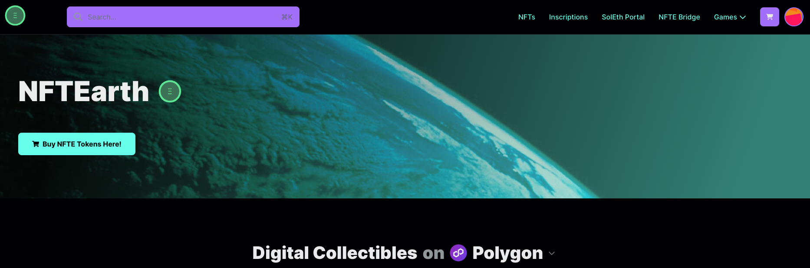

<h3 align="center">NFTEarth</h3>
  

# App 

[NFTEarth](https://nftearth.exchange)

Omnichain NFT protocol.

NFT Marketplace, NFTFi, SocialFi, GameFi, NFT Launchpad, and AI-infused NFTs - all part of the NFTEarth protocol.

### Built With

- [ReservoirKit](https://docs.reservoir.tools/docs/reservoir-kit)
- [Reservoir Protocol and API](https://reservoirprotocol.github.io/)
- [Next.js](https://nextjs.org/)
- [React.js](https://reactjs.org/)
- [Ethers.io](https://ethers.io/)
- [WAGMI](https://wagmi.sh/)
- [Stitches](https://stitches.dev/docs/variants)

## Contact

X: [@NFTEarth_L2](https://twitter.com/NFTEarth_L2)

